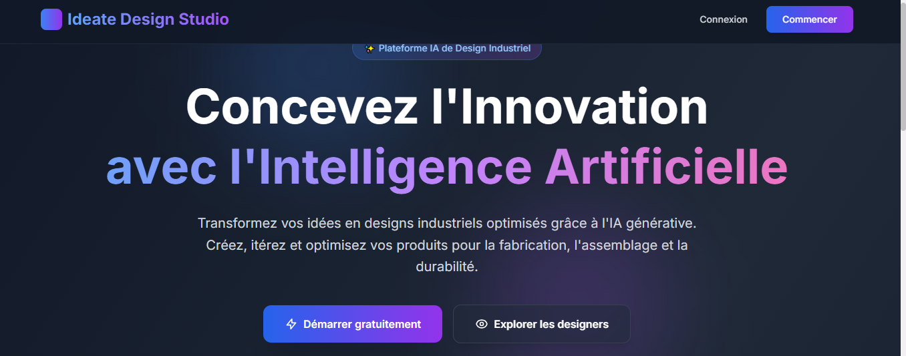

=====================================================
Ideate design Studio - Documentation Technique
=====================================================

.. centered:: **Plateforme Intelligente de Design Industriel avec Analyse DfX**

.. note::
   Projet d'Expertise - École Nationale Supérieure d'Arts et Métiers (ENSAM)

   Réalisé par : Oussama Fahim    

   Encadré par : Mr. Tawfik Masrour et Mrs. Ibtissam El Hassani

----

Table des matières
------------------

- `Introduction <index.html#id1>`_

Introduction
============

**Ideate Studio** est une plateforme web innovante dédiée au design industriel moderne, alliant **intelligence artificielle générative** et **analyse Design for Excellence (DfX)** pour révolutionner le processus de conception de produits.

Dans un contexte où l'industrie 4.0 transforme les méthodes traditionnelles de conception, Ideate Studio se positionne comme un outil stratégique permettant aux designers et ingénieurs de créer, analyser et optimiser leurs concepts de manière intelligente et collaborative.

Vision du Projet
----------------

Notre vision est de démocratiser l'accès aux technologies d'IA générative tout en intégrant les principes d'ingénierie industrielle, créant ainsi un écosystème où créativité et fabricabilité convergent naturellement.

**Principes directeurs :**

* **Accessibilité** : Interface intuitive pour designers de tous niveaux
* **Intelligence** : Intégration profonde de l'IA pour guider les décisions de design
* **Qualité** : Analyse DfX automatique garantissant la fabricabilité
* **Collaboration** : Partage et amélioration collective des designs
* **Performance** : Architecture moderne et optimisée

Contexte Académique
-------------------

Ce projet a été développé dans le cadre d'un **projet d'expertise** à l'**École Nationale Supérieure d'Arts et Métiers (ENSAM)** de Meknès, sous la supervision de :

* **M. Tawfik Masrour** - Encadrant et Chef de Filière
  Expert en Génie Industriel et Intelligence Artificielle
  
* **Mme Ibtissam El Hassani** - Encadrante
  Experte en Design Industriel et Innovation Produit

Le projet s'inscrit dans une démarche de recherche appliquée visant à explorer l'intersection entre l'IA générative et les méthodologies DfX traditionnelles.

Problématique
=============

Le Défi du Design Industriel Moderne
-------------------------------------

Les équipes de conception industrielle font face à plusieurs **défis majeurs** dans leur processus de développement produit :

**1. Génération Conceptuelle Limitée**

* Difficulté à explorer rapidement de multiples variantes de design
* Processus de sketching et de prototypage chronophage
* Manque d'outils accessibles pour la génération d'idées visuelles
* Barrière technique élevée pour utiliser l'IA générative

**2. Évaluation Tardive de la Fabricabilité**

* Découverte des problèmes DfX en phase avancée de conception
* Coûts élevés de modification après validation du design
* Absence d'analyse automatisée de fabricabilité
* Métriques DfX manuelles et subjectives

**3. Cycle Itératif Inefficace**

* Manque de traçabilité dans l'évolution des designs
* Difficulté à comparer objectivement les itérations
* Feedback non structuré et non quantifiable
* Perte de connaissance entre les versions

**4. Fragmentation des Outils**

* Multiplication des plateformes (IA, CAO, analyse)
* Workflow discontinu et transferts de fichiers complexes
* Absence d'intégration entre génération et analyse
* Courbe d'apprentissage importante pour chaque outil

**5. Collaboration Limitée**

* Partage difficile des concepts en phase exploratoire
* Manque de standardisation dans la documentation design
* Absence de plateforme centralisée pour le travail d'équipe
* Difficulté à capitaliser sur les expériences collectives

Impact sur l'Industrie
----------------------

Ces problématiques entraînent :

* **Augmentation des coûts** : Modifications tardives coûteuses
* **Allongement des délais** : Time-to-market prolongé
* **Qualité variable** : Designs non optimisés pour la fabrication
* **Innovation freinée** : Exploration limitée de l'espace de conception

Besoin Identifié
----------------

Il existe donc un **besoin critique** pour une solution qui :

✓ Combine génération IA et analyse DfX en temps réel
✓ Offre un workflow itératif structuré et traçable
✓ Rend accessible la puissance de l'IA générative
✓ Intègre l'analyse de fabricabilité dès la conception
✓ Facilite la collaboration et le partage de connaissances

Solution
========

Architecture Globale
--------------------

**Ideate Studio** répond à ces défis à travers une **plateforme web intégrée** combinant trois piliers technologiques :

.. code-block:: text

   ┌─────────────────────────────────────────────────────────┐
   │                    IDEATE STUDIO                        │
   ├─────────────────────────────────────────────────────────┤
   │                                                         │
   │  ┌──────────────┐  ┌──────────────┐  ┌─────────────┐  │
   │  │  Génération  │  │   Analyse    │  │   Gestion   │  │
   │  │      IA      │→ │     DfX      │→ │   Projet    │  │
   │  └──────────────┘  └──────────────┘  └─────────────┘  │
   │         ↓                  ↓                 ↓         │
   │  ┌─────────────────────────────────────────────────┐  │
   │  │         Workflow Itératif Intelligent           │  │
   │  └─────────────────────────────────────────────────┘  │
   │                                                         │
   └─────────────────────────────────────────────────────────┘

Approches Innovantes
--------------------

**1. Génération Intelligente Multi-Modale**

Notre solution intègre **trois modes de génération complémentaires** :

* **Texte → Image** : Utilisation de modèles Stable Diffusion 3/FLUX pour transformer descriptions textuelles en visualisations produit haute qualité
* **Croquis → Image** : Pipeline ControlNet Scribble pour raffiner sketches manuels en designs détaillés
* **Raffinement Guidé** : Amélioration itérative basée sur l'analyse DfX et le feedback utilisateur

**2. Analyse DfX en Temps Réel**

Système d'évaluation automatique multi-aspects :

* **DFM** (Design for Manufacturing) : Évaluation de la fabricabilité
* **DFA** (Design for Assembly) : Analyse de l'assemblabilité
* **DFS** (Design for Service) : Maintenabilité et accessibilité
* **DFSust** (Design for Sustainability) : Impact environnemental

Chaque génération reçoit instantanément un **score DfX** (0-100%) avec recommandations d'amélioration détaillées.

**3. Workflow Itératif Structuré**

Méthodologie en **5 étapes guidées** :

.. code-block:: text

   Brief → Croquis → Génération → Amélioration → Finalisation
     ↓        ↓          ↓            ↓            ↓
   IA Mistral  Upload  SD3/FLUX   Feedback    Rapport DfX

**4. Système de Transformation 3D**

Pipeline innovant **Image 2D → Modèle 3D** :

* Utilisation de Stable Fast 3D pour extraction de profondeur
* Génération de maillages texturés au format GLB
* Export compatible logiciels professionnels (Blender, Unity, etc.)

Valeur Ajoutée
--------------

**Pour les Designers :**

* ⚡ Génération rapide de multiples variantes
* 📊 Feedback DfX immédiat et actionnable
* 🔄 Traçabilité complète du processus itératif
* 💾 Archivage automatique avec métadonnées

**Pour les Équipes :**

* 🤝 Collaboration via projets publics/privés
* 📈 Capitalisation des meilleures pratiques
* 🎯 Standardisation du workflow de conception
* 🌐 Accessibilité web multiplateforme

**Pour l'Entreprise :**

* 💰 Réduction des coûts de modification
* ⏱️ Accélération du time-to-market
* ✅ Amélioration de la qualité produit
* 🔬 Intégration R&D et production

Technologies Clés
-----------------

La solution s'appuie sur une **stack technologique moderne** :

**Frontend**
   * Next.js 14 (React Server Components)
   * Tailwind CSS pour UI responsive
   * Three.js pour visualisation 3D

**Backend & Infrastructure**
   * Supabase (Auth, Database, Storage)
   * PostgreSQL avec Row Level Security
   * API Routes serverless

**Intelligence Artificielle**
   * Stable Diffusion 3 Medium/Large
   * FLUX.1 Dev/Schnell
   * Mistral AI pour génération de prompts
   * Stability AI ControlNet & Fast 3D

**Analyse & Métrique**
   * Système DfX règles + heuristiques
   * Vision par ordinateur pour extraction features
   * Scoring multi-critères pondéré

Différenciation
---------------

Ideate Studio se distingue par :

1. **Intégration unique** IA générative + analyse DfX
2. **Accessibilité** via interface web (pas d'installation)
3. **Pédagogie** explications détaillées des scores DfX
4. **Open workflow** compatible avec outils existants
5. **Focus industriel** au-delà du design artistique

----

Modèles utilisés
================

L'application utilise 15 modèles d'IA spécialisés couvrant la génération d'images 2D, 3D, de texte et l'analyse visuelle.

.. contents::
   :depth: 3
   :local:

Modèles de Génération d'Images 2D
---------------------------------

Stable Diffusion 3 Medium (Diffusers)
^^^^^^^^^^^^^^^^^^^^^^^^^^^^^^^^^^^^^

**Fournisseur:** Hugging Face  
**Type:** Diffusion de texte à image  
**Résolution:** SDXL (1024x1024 et variantes)  
**Endpoint:** ``stabilityai/stable-diffusion-3-medium-diffusers``  

**Description:**  
Modèle équilibré offrant un bon compromis entre qualité et vitesse. Spécialement optimisé pour les designs industriels, il génère des images détaillées avec une compréhension contextuelle avancée.

**Utilisation dans le projet:**
- Mode Design Rapide & Itératif
- Génération initiale de concepts
- Intégration avec l'analyse DfX

**Caractéristiques techniques:**
- Dimensions supportées: 1024x1024, 1152x896, 896x1152
- Inférence: 30-50 steps recommandés
- Guidance scale: 7.5 optimal

Stable Diffusion 3.5 Large
^^^^^^^^^^^^^^^^^^^^^^^^^^

**Fournisseur:** Hugging Face  
**Type:** Diffusion de texte à image  
**Résolution:** SDXL avancé  
**Endpoint:** ``stabilityai/stable-diffusion-3.5-large``  

**Description:**  
Version améliorée de SD3 avec des capacités de rendu photo-réaliste exceptionnelles. Produit des images très détaillées avec une précision textuelle supérieure.

**Utilisation dans le projet:**
- Designs de haute fidélité
- Présentations finales
- Visualisations réalistes

Stable Diffusion XL Base
^^^^^^^^^^^^^^^^^^^^^^^^

**Fournisseur:** Hugging Face  
**Type:** Diffusion de texte à image  
**Résolution:** SDXL standard  
**Endpoint:** ``stabilityai/stable-diffusion-xl-base-1.0``  

**Description:**  
Modèle fondamental pour la génération d'images haute résolution. Excellent pour les détails fins et les compositions complexes.

**Dimensions SDXL autorisées:**
- 1024x1024
- 1152x896 / 896x1152
- 1216x832 / 832x1216
- 1344x768 / 768x1344
- 1536x640 / 640x1536

Stable Diffusion 3.5 Large Turbo
^^^^^^^^^^^^^^^^^^^^^^^^^^^^^^^^

**Fournisseur:** Hugging Face  
**Type:** Diffusion de texte à image optimisée  
**Résolution:** SDXL  
**Endpoint:** ``stabilityai/stable-diffusion-3.5-large-turbo``  

**Description:**  
Version accélérée pour la génération quasi-temps réel. Idéal pour les itérations rapides et l'exploration de concepts.

**Avantages:**
- Génération en 1-2 secondes
- Qualité préservée malgré la vitesse
- Parfait pour le workflow itératif

FLUX.1 Schnell
^^^^^^^^^^^^^^

**Fournisseur:** Hugging Face  
**Type:** Modèle de flux de génération  
**Résolution:** SDXL  
**Endpoint:** ``black-forest-labs/FLUX.1-schnell``  

**Description:**  
Architecture FLUX optimisée pour la vitesse. Produit des rendus conceptuels instantanés avec une cohérence stylistique.

**Caractéristiques:**
- Génération ultra-rapide
- Style cohérent
- Idéal pour les brainstormings

FLUX.1 Dev
^^^^^^^^^^

**Fournisseur:** Hugging Face  
**Type:** Modèle de flux expérimental  
**Résolution:** SDXL  
**Endpoint:** ``black-forest-labs/FLUX.1-dev``  

**Description:**  
Version de développement pour l'expérimentation et les tests. Permet d'explorer de nouvelles approches de génération.

FLUX.1 Kontext Dev
^^^^^^^^^^^^^^^^^^

**Fournisseur:** Hugging Face  
**Type:** Modèle contextuel  
**Résolution:** SDXL  
**Endpoint:** ``black-forest-labs/FLUX.1-Kontext-dev``  

**Description:**  
Spécialisé dans la gestion du contexte dans la génération. Maintient la cohérence à travers les multiples éléments d'une scène.

FLUX.1 Krea Dev
^^^^^^^^^^^^^^^

**Fournisseur:** Hugging Face  
**Type:** Modèle créatif avancé  
**Résolution:** SDXL  
**Endpoint:** ``black-forest-labs/FLUX.1-Krea-dev``  

**Description:**  
Focalisé sur la création artistique et générative avancée. Produit des designs innovants et originaux.

Modèles de Contrôle par Croquis (ControlNet)
--------------------------------------------

Control Sketch
^^^^^^^^^^^^^^

**Fournisseur:** Stability AI  
**Type:** ControlNet pour croquis  
**Format:** SDXL + ControlNet  
**Endpoint:** ``v2beta/stable-image/control/sketch``  

**Description:**  
Transforme des croquis en images détaillées tout en préservant la structure du dessin original. Utilise des techniques de contrôle de structure pour guider la génération.

**Paramètres optimaux:**
- Force de contrôle: 0.7
- Steps: 30-40
- Guidance scale: 7

**Utilisation dans le projet:**
- Mode "Croquis → Image"
- Transformation de dessins techniques
- Exploration conceptuelle à partir d'esquisses

Control Structure
^^^^^^^^^^^^^^^^^

**Fournisseur:** Stability AI  
**Type:** ControlNet pour structure  
**Format:** SDXL + ControlNet  
**Endpoint:** ``v2beta/stable-image/control/structure``  

**Description:**  
Maintient la structure géométrique lors des améliorations itératives. Parfait pour le raffinement de designs existants.

**Utilisation dans le projet:**
- Améliorations itératives
- Raffinement basé sur le feedback
- Conservation de la structure originale

Modèles de Génération de Texte
------------------------------

Mistral 7B (Brief Generator)
^^^^^^^^^^^^^^^^^^^^^^^^^^^^

**Fournisseur:** Mistral AI  
**Type:** Modèle de langage (LLM)  
**Capacité:** 7 milliards de paramètres  
**Endpoint:** API Mistral ``/v1/chat/completions``  

**Description:**  
Génère des briefs design détaillés et traduit les prompts en anglais pour les APIs qui le requièrent. Spécialisé dans la compréhension des contraintes techniques.

**Fonctions principales:**
1. Génération automatique de prompts
2. Traduction français → anglais
3. Enrichissement avec contraintes DfX
4. Raffinement de prompts basé sur l'analyse

**Configuration typique:**
- Modèle: ``mistral-small-latest``
- Température: 0.7
- Max tokens: 300

Mistral Vision (DfX Analyzer)
^^^^^^^^^^^^^^^^^^^^^^^^^^^^^

**Fournisseur:** Mistral AI  
**Type:** Modèle multimodal (vision + texte)  
**Capacité:** Analyse d'images avancée  

**Description:**  
Analyse les images générées pour extraire des métriques DfX (Design for X). Évalue automatiquement la conformité aux principes de design industriel.

**Métriques analysées:**
- Design for Assembly (DFA): nombre de pièces, types de fixations
- Design for Manufacturing (DFM): épaisseur de paroi, angles de dépouille
- Design for Service (DFS): modularité, accessibilité
- Design for Sustainability (DFSust): matériaux recyclables, efficacité

Modèles de Génération 3D
------------------------

Stable Fast 3D
^^^^^^^^^^^^^^

**Fournisseur:** Stability AI  
**Type:** Génération d'objets 3D à partir d'images 2D  
**Format:** GLB (glTF binaire)  
**Endpoints testés:**
- ``https://api.stability.ai/v2beta/stable-image/3d/stable-fast-3d``
- ``https://api.stability.ai/v1/generation/3d/stable-fast-3d``
- ``https://api.stability.ai/v1/generation/stable-fast-3d``
- ``https://api.stability.ai/v2beta/3d/stable-fast-3d``

**Description:**  
Transforme des images 2D en modèles 3D texturés optimisés. Utilise des techniques avancées de reconstruction géométrique et de projection de texture.

**Paramètres configurables:**

.. list-table::
   :header-rows: 1
   :widths: 30 30 40
   
   * - Paramètre
     - Valeur par défaut
     - Description
   * - texture_resolution
     - 1024
     - Résolution des textures en pixels
   * - foreground_ratio
     - 0.85
     - Ratio objet/fond pour l'extraction
   * - remesh_option
     - triangle
     - Méthode de remaillage (triangle/quad)

**Workflow de génération:**
1. Upload et optimisation de l'image (redimensionnement à 1024x1024)
2. Appel à l'API Stable Fast 3D avec retry sur plusieurs endpoints
3. Récupération du modèle GLB
4. Génération de thumbnail et sauvegarde

**Fallback intelligent:**
En cas d'échec de l'API, le système génère un modèle 3D de démonstration (cube GLB minimal) pour assurer la continuité du workflow.

**Intégration DfX:**  
Les modèles 3D générés peuvent être analysés selon les mêmes principes DfX que les images 2D, avec adaptation des métriques pour la 3D.

Tableau de Synthèse des Modèles
-------------------------------

.. list-table::
   :header-rows: 1
   :widths: 20 15 15 20 15 15
   
   * - Modèle
     - Fournisseur
     - Type
     - Format/Endpoint
     - Résolution
     - Usage principal
   * - SD3 Medium
     - Hugging Face
     - Texte→Image
     - stabilityai/stable-diffusion-3-medium-diffusers
     - SDXL
     - Design rapide
   * - SD3.5 Large
     - Hugging Face
     - Texte→Image
     - stabilityai/stable-diffusion-3.5-large
     - SDXL
     - Haute fidélité
   * - SD XL Base
     - Hugging Face
     - Texte→Image
     - stabilityai/stable-diffusion-xl-base-1.0
     - SDXL
     - Détails fins
   * - SD3.5 Turbo
     - Hugging Face
     - Texte→Image
     - stabilityai/stable-diffusion-3.5-large-turbo
     - SDXL
     - Itérations rapides
   * - FLUX.1 Schnell
     - Hugging Face
     - Flux→Image
     - black-forest-labs/FLUX.1-schnell
     - SDXL
     - Concepts instantanés
   * - Control Sketch
     - Stability AI
     - Croquis→Image
     - v2beta/stable-image/control/sketch
     - SDXL + ControlNet
     - Transformation croquis
   * - Control Structure
     - Stability AI
     - Structure→Image
     - v2beta/stable-image/control/structure
     - SDXL + ControlNet
     - Raffinement itératif
   * - Mistral 7B
     - Mistral AI
     - Texte→Texte
     - API /v1/chat/completions
     - LLM 7B
     - Briefs & traduction
   * - Mistral Vision
     - Mistral AI
     - Image→Analyse
     - API Vision
     - Multimodal
     - Analyse DfX
   * - Stable Fast 3D
     - Stability AI
     - Image→3D
     - Multiple endpoints
     - GLB 3D
     - Génération 3D

Architecture d'Intégration
--------------------------

**Flux de données entre modèles:**

.. mermaid::
   :caption: Workflow d'intégration des modèles

   graph TD
       A[Brief utilisateur] --> B[Mistral 7B]
       B --> C[Prompt enrichi DfX]
       C --> D{Génération 2D/3D}
       D --> E[Modèles SD/FLUX]
       D --> F[Stable Fast 3D]
       E --> G[Image générée]
       F --> H[Modèle 3D GLB]
       G --> I[Mistral Vision]
       H --> I
       I --> J[Rapport DfX]
       J --> K[Recommandations]
       K --> L[Raffinement]
       L --> B

**Considérations techniques:**

1. **Traduction automatique:** Tous les prompts sont automatiquement traduits en anglais pour les APIs qui le requièrent
2. **Fallback multi-niveaux:** Chaque modèle a des mécanismes de fallback pour assurer la disponibilité
3. **Optimisation des ressources:** Les images sont automatiquement redimensionnées et optimisées avant traitement
4. **Sauvegarde incrémentale:** Toutes les itérations sont sauvegardées avec métadonnées complètes

**Exigences système:**

- **Mémoire:** Minimum 4GB RAM pour le traitement d'images
- **Réseau:** Connexion stable pour les appels API
- **Stockage:** Espace pour les modèles 3D (5-50MB par modèle)
- **API Keys:** Configuration requise pour Stability AI, Hugging Face, et Mistral AI

Cette architecture modulaire permet de remplacer ou ajouter facilement de nouveaux modèles sans perturber le workflow existant.

Contact & Contribution
======================

.. admonition:: Informations Projet
   :class: tip

   **Développeur** : Oussama Fahim
   
   **Institution** : ENSAM Meknès, Université Moulay Ismail
   
   **Encadrants** : 
   
   * M. Tawfik Masrour (Chef de Filière, Expert IA & Génie Industriel)
   * Mme Ibtissam El Hassani (Experte Design Industriel)
   
   **Année** : 2024-2025
   
   **Type** : Projet d'Expertise en Génie Industriel

.. note::
   Cette documentation est en constante évolution. Pour toute question, suggestion ou contribution, 
   n'hésitez pas à consulter la section FAQ ou à contacter l'équipe de développement.

----

.. centered:: © 2025 Ideate Studio - ENSAM Meknès. Tous droits réservés.

